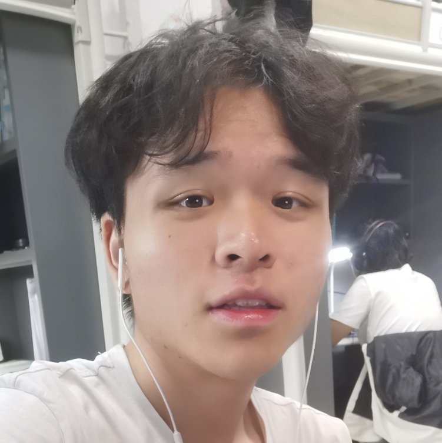

<h1>Jiakang Li</h1>
<html xmlns="http://www.w3.org/1999/xhtml">
    <head profile="http://www.w3.org/2006/03/hcard">
        <title>Jiakang Li,Lanzhou University</title>
        
            
            

                <h2>About Me</h2>
                
I am a junior student studying,in the <a href="http://xxxy.lzu.edu.cn/">Department of Information Science and Engineer </a>  (by courtesy) at  Lanzhou University(since 2019). I am affiliated with the <a href="http://xxxy.lzu.edu.cn/jigoushezhi/xisuoshezhi/2020/1014/139911.html"> Centers for Computer Software and Theory </a> with Professor <a href="http://xxxy.lzu.edu.cn/shiziduiwu/jiaoshiduiwu/jiaoshou/2020/0914/132022.html"> Yonggang Lu </a> 
 
                

                    <h2>CV/resume</h2>
                    
                <a href="https://github.com/jiakanglee/jiakanglee.github.io/blob/main/Jiakang%20Li_resume.pdf">My personal resume </a>  
                <a href="https://github.com/jiakanglee/jiakanglee.github.io/blob/main/Jiakang%20Li_Academic%20Resume.pdf">My Academic resume </a>
                
                    
                

                
                

                    <h2>Contact info</h2>
                    
                    Email:ljiakang0527@gmail.com/jkli19@lzu.edu.cn
                
    
                    
                    
                

                    <h2>Work Experience</h2>
                    •Algorithm intern at Trip(<a href = "https://www.trip.com/">携程</a>-Biggest OTA in Asia and Third OTA in the world)  
                    Jun 2022 -present
                

                

                    <h2>Research Experience</h2> 
                    • Research Intern at Lanzhou University with Advisor: professor Yonggang Lu  
                    Jan 2022 – Present  
                    Revised Medoid Based on Knn:Applying on Social Network Introduced k-nearest neighbour to traditional medoid algorithm.  
                    Bring a new insight to machine learning on community detection.  
                    Effectively improve efficiency compared with some state-of-the-art community detection method and medoid algorithm based on radius on large scale datasets.
                    
                

                

                    <h2>Research Interest</h2>
                    
                    I'm currently researching on Machine Learning,especially for Clustering Algorihthm methods, theory, for which I'm trying to apply on  Social Network. To this end, my research aims at: 
                    <ul>
                        <li>Machine Learning Cluster Algorithm, both practically and theoretically, in a principled manner to enable its applications in critical domains;</li>
                        <li>Machine Learning on data/model privacy/security,especially with those involving graph and/or other research areas among everyday life</li>
                    </ul>
                    With this aim in mind, my research interests span across machine learning.
                

                

                
